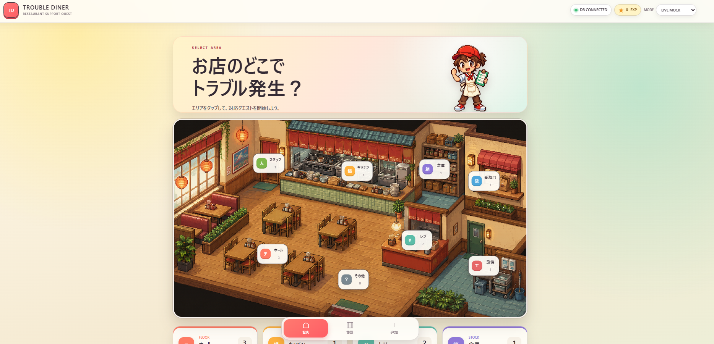
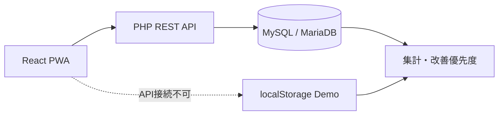

<div align="center">

# TROUBLE DINER

### お店のピンチを、みんなの攻略データに。

作業者の判断を支え、対応履歴を改善へつなげる  
飲食店トラブル対応フローの個人PoC

</div>

## Demo

[TROUBLE DINERを試す](https://ryohei0otsuka.github.io/trouble-diner/)



## About

飲食店でトラブルが起きたとき、作業者が「何を確認するか」「どこまで対応するか」「誰へ引き継ぐか」で迷う時間を減らすためのタッチパネル型Webアプリです。

```text
受付 → 確認 → 切り分け → 対応／引き継ぎ → 記録 → 集計 → 改善
```

## Features

- YES／NOを中心にした1画面1判断の対応フロー
- 「判断できない」「危険を感じる」の退避ルート
- フロー結果による対応レベルの自動判定
- 確認経路を含むエスカレーション票の生成
- 改善優先スコアを表示する集計画面
- 対応履歴のCSV出力
- MySQLとブラウザ内DEMO MODEの両方に対応

## Architecture



## Tech Stack

`React 19` `TypeScript 5.9` `Vite 8.2` `PHP 8.1+` `MySQL / MariaDB` `XAMPP` `PWA`

## Local Setup

XAMPPでApacheとMySQLを起動し、phpMyAdminから`database/setup.sql`をインポートします。その後、リポジトリ直下で実行します。

```powershell
npm install
npm run dev
```

[http://localhost:5173/](http://localhost:5173/)を開き、画面右上が`DB CONNECTED`ならMySQL接続版、`DEMO MODE`ならブラウザ内デモです。

## Disclaimer

本プロジェクトは特定の企業・業務・サービスを再現したものではなく、架空の飲食店トラブルを題材とした個人PoCです。実際の緊急対応や食品衛生上の判断を代替するものではありません。

## License

MIT License
